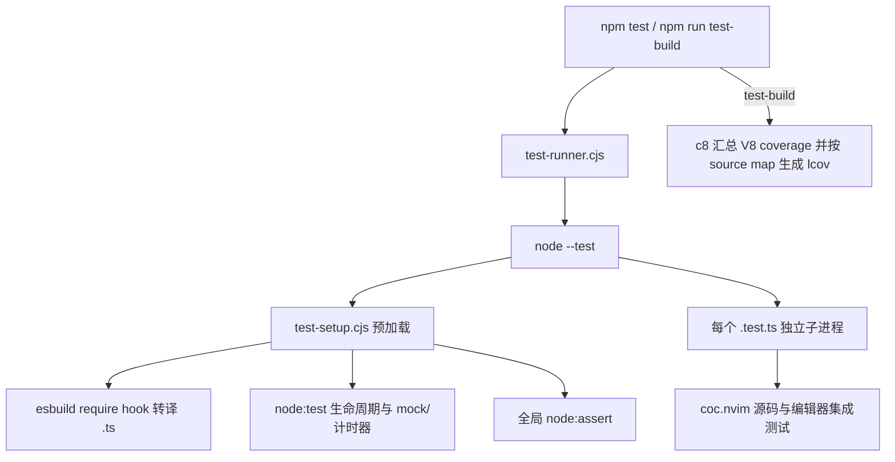

# Node.js Test 迁移计划

## 概述

将测试运行器从 Vitest 迁移到 Node.js 20.19 自带的 `node:test`，删除 `vitest` 与
`@vitest/coverage-v8` 依赖，同时保持现有 TypeScript 测试、测试隔离、mock、假计时器、
超时、CI 覆盖率和定向运行能力。

结论：可以迁移，但 Node.js 20 不能直接执行 TypeScript，而且其内置测试覆盖率不能排除
测试目录，也不能按现有范围纳入全部源码。因此让 `node:test` 成为唯一测试运行器，复用现有
esbuild 做即时转译，并使用 `c8` 保持当前 TypeScript 覆盖率范围。

断言迁移分两步比较：第一步使用基于 `node:assert` 的仓库内 `expect` 兼容层；第二步把所有
调用点直接迁移到 `node:assert` 并删除兼容层。当前执行第二步，最终是否与运行器迁移合并由
Node.js 20 CI 的行为对比决定。

## 当前问题分析

- 仓库最低支持 Node.js 20.19，CI 也运行 Node.js 20。
- 迁移前有 122 个 `*.test.ts` 文件约 60,000 行；删除兼容层自身测试后剩余 121 个。Node.js 20
  不能直接加载这些 TypeScript 文件。
- 121 个测试文件使用全局 `expect`，共有 6,519 个调用。`node:test` 不提供 `expect`；直接迁移
  到 `node:assert` 会修改全部调用点，但可以删除仓库维护的断言语义和 matcher。
- 73 个测试文件使用 `vi`；当前用到 262 次 `spyOn`、135 次 `fn`、假计时器、轮询和
  mock 清理。
- 现有 Vitest 配置将无编辑器测试放在线程中共享模块缓存，将编辑器测试放在隔离进程中，
  并单独执行 `vim.test.ts`。`node:test` 在 Node.js 20 中按文件使用子进程隔离，语义更安全，
  但启动成本可能更高。
- Vitest 当前支持第三个数字参数作为测试超时；`node:test` 使用 `TestOptions`，需要把慢测试
  直接改为 `{ timeout }`。
- Node.js 20 内置测试覆盖率可以输出 lcov，但不能排除 `src/__tests__`，也不能按当前配置纳入
  全部未执行的 `src/**/*.ts`。Node.js 的测试覆盖率 include/exclude CLI 选项到 22.5 才加入。
- `src/__tests__/handler/workspace.test.ts` 使用一次模块级 `vi.mock`。应改为可恢复的方法 mock，
  避免依赖 Node.js 20 的实验性模块 mock。

## 调用链 / 架构图

## 策略和方案

1. 用一个 CommonJS 预加载文件注册 `.ts` require hook。hook 调用仓库已有的 esbuild，
   保留原文件名、`__dirname`、内联 source map 和 CommonJS 语义，不增加 TypeScript 运行器。
2. 预加载文件把 `node:test` 的 `describe`、`it`、`test` 和 hooks 直接暴露为现有全局名称。
   慢测试在调用点使用原生 `TestOptions`，不保留测试 API 包装。
3. 测试回调直接使用 `TestContext.mock`；测试外 helper 显式接收 `MockTracker`；suite 的
   `beforeAll` 因为只提供 `SuiteContext`，使用 `node:test` 导出的顶层 `MockTracker` 并显式恢复。
   假计时器直接使用 `MockTracker.timers`，不保留全局 `vi` 或 mock 装饰器。
4. 将现有 matcher 直接改写为 `node:assert`：相等、异常和 Promise 使用对应原生断言；mock
   直接检查 `MockFunctionContext.callCount()` 与 `calls`；少量非对称 matcher 改为针对业务字段
   的明确断言。删除 `test-assertions.cjs`，不保留新的断言 helper。
5. 使用 Node.js 脚本递归发现 `src/__tests__/**/*.test.ts`，显式传给 `node --test`；
   `vim.test.ts` 通过一个只设置 `VIM_NODE_RPC=1` 的包装入口执行。
6. 普通测试由 `npm test` 运行；覆盖率由 `c8` 包裹同一入口，输出 text 与
   `coverage/lcov.info`。CI 只调用 npm script，不再直接调用 Vitest 二进制。
7. 删除 Vitest 配置和依赖，更新 TypeScript 与 oxlint 的测试全局声明。

选择此方案的原因：它把运行、隔离、生命周期、mock、计时器和断言交给 Node.js 标准库，只为
Node.js 20 缺失的 TypeScript 加载和覆盖率范围控制保留 esbuild 与 `c8`。

## 实施步骤

1. ✅ 建立 Node.js 测试入口、TypeScript 预加载和测试全局类型。
2. ✅ 在代表性单元测试上验证普通断言、异步失败、原生 MockTracker、MockTimers 和直接调用记录。
3. ✅ 删除显式 Vitest import，处理唯一的模块 mock，并接入全部测试文件发现。
4. ✅ 更新 `package.json`、lockfile、oxlint 和 CI，删除 Vitest 配置文件。
5. ✅ 运行定向测试、`npm run lint:typecheck`、`npm run lint`、`npm run build`、覆盖率冒烟和
   `git diff --check`。
6. ⏳ 在 Node.js 20 CI 运行全量测试并比较耗时与失败语义；若子进程模型造成不可接受的回退，
   则回滚依赖与入口，不保留双运行器。本地按约定不运行全量测试。
7. ✅ 将 6,519 个 `expect` 调用迁移到 `node:assert`，删除断言兼容层并完成静态验证。

## 风险评估

- **TypeScript 加载差异**：esbuild require hook 可能暴露模块互操作差异。先验证纯单元、
  CommonJS server fixture 和编辑器集成三类测试。
- **mock 语义差异**：Node.js mock 的调用记录不是参数数组，且 once implementation 需要显式
  调用序号。matcher 直接读取原生调用记录；连续 once 行为在调用点使用 `onCall`，单次替换使用
  `{ times: 1 }`。
- **断言语义差异**：`assert.deepStrictEqual` 会区分缺失属性与值为 `undefined` 的属性，也会区分
  稀疏数组空位与显式 `undefined`；这与原 `toEqual` 不同。迁移不复制旧语义，由 Node.js 20 CI
  找出依赖旧语义的业务断言，再在具体调用点明确期望值。
- **假计时器差异**：Node.js 20 MockTimers 仍是实验性 API。用当前四个假计时器测试文件作为
  门禁，依赖 TestContext 自动恢复，并在需要提前恢复的测试中显式 `reset()`。
- **覆盖率偏差**：Node.js 20 内置测试覆盖率不能复刻当前 include/exclude 范围。使用 c8；
  若 lcov 不能指回原始 `src/**/*.ts`，迁移不得完成。
- **性能回退**：`node:test` 每文件一个子进程，无法复刻 Vitest 的无隔离线程池与慢测试缓存。
  记录代表性测试耗时，并在 CI 保留并发度 2。
- **环境差异**：当前本机 Node.js 是 26.7.0，而项目基线是 20.19。CI 已固定为 Node.js 20.19.0，
  最终由 CI 验证 runner、mock timers 和覆盖率命令。

## 成功标准

- `package.json`、lockfile、源码、CI 和 lint 配置中不再依赖 Vitest、`expect` 或 Jest 包。
- `npm test -- <test paths>` 能定向运行 TypeScript 测试；默认入口能发现全部 121 个测试文件。
- 代表性普通单元、mock、假计时器和编辑器集成行为通过；`vim.test.ts` 与全量行为由 CI 验证。
- `npm run test-build -- <test paths>` 生成 `coverage/lcov.info`，源文件指向原始 TypeScript。
- `npm run lint:typecheck`、`npm run lint`、`npm run build` 和 `git diff --check` 通过。
- `test-assertions.cjs`、全局 `expect` 类型以及兼容层自身测试均已删除，TypeScript 测试源码
  不再出现运行中的 `expect(` 或 `expect.*`。
- 不修改或删除用户已有的未跟踪文件 `AGENTS.md`、`_typos.toml`。

## 进度跟踪

- ✅ 完成仓库、测试 API、Node.js 20 能力和 CI 约束盘点。
- ✅ 完成最小原型、运行器迁移和 Vitest 依赖清理。
- ✅ 删除 standalone `expect` 及其 37 个传递包，改用 `node:assert` 窄兼容层。
- ✅ 本地完成 616 个定向测试、10 个 source-map 覆盖率冒烟测试、全仓 lint、类型检查、构建与
  diff 检查。
- ✅ 删除自维护的 `clearAllMocks`、once implementation 游标和 `vi` facade；测试直接使用
  `TestOptions`、`MockTracker` 与 `MockTimers`。
- ✅ 重命名 Vim harness，并将 CI 固定到 Node.js 20.19.0。
- ✅ 将四个测试基础设施文件移到仓库根目录，并使用 `test-*.cjs` 名称明确其用途。
- ✅ 将不可由 `node:test` 替换的模块导出 getter mock 下移到 `child_process.exec` 副作用接缝。
- ✅ 修复断言兼容层传递空 `message` 时遮蔽真实失败的问题，并将 inline 测试中的 `nvim.call`
  替换改为可恢复的 method spy；`inline.test.ts` 定向运行 82 个测试全部通过。
- ✅ 将纯单元测试中的 sleep 改用保持事件循环存活的 `node:timers/promises`，避免 Node.js 20
  在只剩 `unref()` timer 时取消仍待完成的测试。
- ✅ 隔离只验证调用的 completion spy。
- ✅ 直接迁移 6,519 个断言调用到 `node:assert`，删除 298 行兼容层、50 行兼容类型和 43 行
  兼容层测试。
- ✅ `npm run lint:typecheck`、隔离环境下的 `npm run lint`、`npm run build` 与 `git diff --check`
  通过；651 个定向测试中 650 个通过。唯一失败是本机代理用例实际返回 401，属于迁移前已知的
  环境差异，留给 Node.js 20 CI 验证。
- ⏳ Node.js 20.19 CI 全量测试、性能和 `vim.test.ts` 验证。

## 相关文件

- `package.json`
- `package-lock.json`
- `.github/workflows/ci.yml`
- `.oxlintrc.json`
- `tsconfig.json`
- `test-runner.cjs`
- `test-setup.cjs`
- `test-assertions.cjs`（删除）
- `test-vim.cjs`
- `src/__tests__/globals.d.ts`
- `src/__tests__/unit/assertions.test.ts`（删除）
- `src/__tests__/**/*.test.ts`（使用原生 TestOptions、MockTracker 和 MockTimers）
- `vitest.config.ts`（删除）
- `vitest.setup.ts`（删除）
